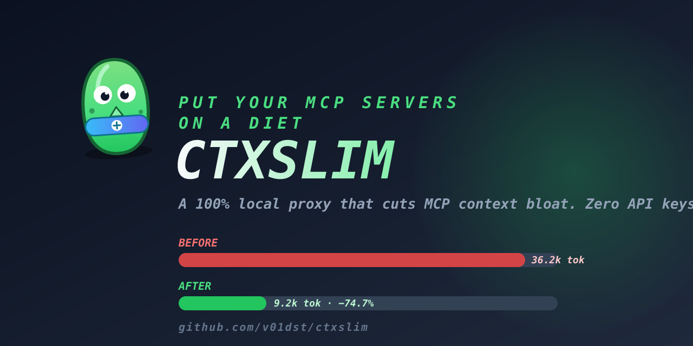
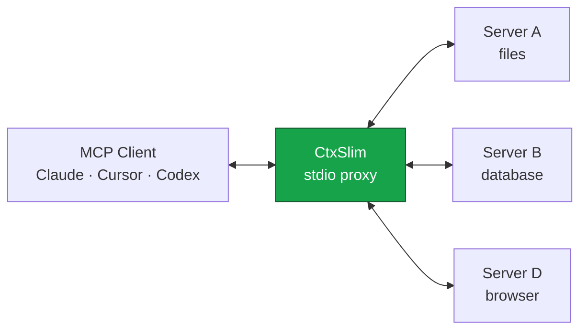

<div align="center">


# CtxSlim

**Your MCP servers are eating your context. Put them on a diet.**



[](https://www.npmjs.com/package/ctxslim)
[](https://www.npmjs.com/package/ctxslim)
[](https://github.com/v01dst/ctxslim/actions)
[](LICENSE)
[](https://nodejs.org)
[](CONTRIBUTING.md)
[](https://github.com/v01dst/ctxslim/stargazers)

*One config entry. Every MCP server you already have. A fraction of the context.*

</div>

---

Every MCP server you connect dumps its **entire tool catalog** into your LLM's context — every name, every description, every JSON Schema property. Connect a database server, a browser server and a GitHub server and you can burn **30,000+ tokens before you've asked a single question**. Your responses get slower, your bill gets bigger, and your agent gets dumber because it's drowning in tool definitions it doesn't need.

**CtxSlim is a proxy that fixes this.** It sits between your MCP client and your servers, exposes only the tools that matter for the current task, and compresses the schemas of what it does expose — with zero API keys, zero cloud calls, zero config rewriting.

## 📊 Measured savings

Real numbers from the bundled benchmark (`npm run bench`), measured through actual MCP transports — not marketing math:

| Setup | Context before | After compression | With top-24 ranking |
| --- | ---: | ---: | ---: |
| 2 servers × 8 tools | 7.4k tokens | −17.7% | −17.7% |
| 4 servers × 10 tools | 18.5k tokens | −17.7% | **−50.6%** |
| 6 servers × 12 tools | 33.4k tokens | −17.7% | **−72.6%** |

The more servers you stack, the more Slim saves. And that's with modest schemas — real-world servers (GitHub, Notion, browser automation) ship far heavier definitions.

## ⚡ Quick start

**Option 1 — the one-liner.** Wire CtxSlim into your client (Claude Desktop, Cursor, Windsurf, VS Code, Claude Code) in seconds:

```bash
npx -y ctxslim init                          # preview: shows what it found on your machine
npx -y ctxslim init --client cursor --yes    # writes it (timestamped backup included)
```

**Option 2 — manual.** Replace your stack of MCP server entries with a single one:

```json
{
  "mcpServers": {
    "ctxslim": {
      "command": "npx",
      "args": ["-y", "ctxslim"]
    }
  }
}
```

That's it. CtxSlim **auto-discovers** the servers already configured in your existing client config (read-only — your files are never modified) and connects to all of them itself.

Works with:

- **Claude Desktop** · **Claude Code** · **Cursor** · **Windsurf** · **VS Code** · anything that speaks MCP
- Or point it at any config explicitly: `npx -y ctxslim --config /path/to/mcp.json`
- Or set `CTX_SLIM_CONFIG=/path/to/mcp.json`
- Or drop a `ctxslim.json` in your project directory

Keep your servers as they are — CtxSlim reads them:

```json
{
  "mcpServers": {
    "github": { "command": "npx", "args": ["-y", "@modelcontextprotocol/server-github"] },
    "postgres": { "command": "npx", "args": ["-y", "@modelcontextprotocol/server-postgres", "postgresql://localhost/mydb"] }
  },
  "slim": {
    "mode": "auto",
    "maxTools": 24,
    "connectTimeout": 45000
  }
}
```

## 🧠 How it works



1. On connection, Slim aggregates every upstream server behind **one surface**.
2. In `auto` mode it exposes only the top-K most relevant tools, plus a `search_tools` meta-tool your agent uses to pull in anything else on demand — progressive disclosure instead of a 40-tool firehose.
3. Exposed schemas are **compressed**: boilerplate keywords stripped, descriptions trimmed to a budget, unused `$defs` dropped — measured with a chars/4 token estimator and reported back to you.
4. Tool calls are routed transparently to the right upstream server. Your agent can't tell the difference — except its context is lighter.

Your agent gets four superpowers:

| Meta tool | What it does |
| --- | --- |
| `search_tools` | Semantic-ish BM25 search across all connected servers |
| `enable_tools` | Pin tools for the session so they're never swapped out |
| `list_servers` | See what's connected and how healthy it is |
| `slim_stats` | Live report of tokens saved this session |

## 🎛 Modes

| Mode | Behavior |
| --- | --- |
| `auto` | Top-K relevant tools per turn + meta tools. **Default.** |
| `manual` | Only servers you allowlist, only tools you pin. Deterministic. |
| `off` | Pure aggregation proxy — every tool, uncompressed. Useful just to unify N servers behind one entry. |

## 🛠 CLI

```
ctxslim                       start the proxy
ctxslim init                  wire the proxy into a detected client config
                              (--client <name|path>, --yes to write, backup included)
ctxslim --config <path>       use a specific config
ctxslim --mode <mode>         auto | manual | off
ctxslim --max-tools <n>       override top-K (default 24)
ctxslim --no-stats            don't persist session stats
ctxslim --quiet               minimal logging
ctxslim stats                 show lifetime savings
ctxslim doctor                validate config + connectivity
```

Session stats live in `~/.ctxslim/stats.jsonl`. Run `ctxslim stats` after a week of work and watch the cumulative savings.

## 🔒 Privacy

CtxSlim is **100% local**. No API keys. No telemetry. No network calls except to the MCP servers you configure. Your tool definitions never leave your machine. The optional stats file stays on your disk and never leaves it.

## ❓ FAQ

**Does my agent really find tools that aren't exposed?**
Yes — that's what `search_tools` is for. Modern agents call it when a task needs something outside the exposed set, get the full compressed schema back, and call the tool. Even if a model skips search and calls a known-but-hidden tool by name, Slim routes it anyway. Nothing is ever hard-blocked.

**Why not just install fewer servers?**
Because you installed them for a reason. The problem isn't having tools — it's paying for all of them in every single prompt.

**What about tool-name collisions?**
If two servers expose the same tool name, Slim prefixes them (`server__tool`) and routes correctly.

**Does it work with HTTP servers?**
Yes — `url` entries are proxied via Streamable HTTP alongside stdio servers.

**Where are the tests?**
55 of them, covering the compressor, the ranking engine, config discovery, the `init` flow, and a full integration suite that speaks real MCP over real transports. `npm test`.

**Is it on npm?**
Yes — [npmjs.com/package/ctxslim](https://www.npmjs.com/package/ctxslim). `npx -y ctxslim` runs it with zero install.

## 🤝 Contributing

Contributions are genuinely welcome — see [CONTRIBUTING.md](CONTRIBUTING.md) for the how and the why. The codebase is small, strict and comment-free on purpose; it's a nice one to read.

**Say hi:** [open an issue](https://github.com/v01dst/ctxslim/issues/new) with your use case, or catch the benchmark breakdown in [docs/design.md](docs/design.md).

## ⭐ Star history

If CtxSlim saved you tokens, a star helps other developers find it:

[](https://github.com/v01dst/ctxslim/stargazers)

## License

[MIT](LICENSE) © 2026

---

<div align="center">
<sub><b>Slim</b> lost the weight so your context doesn't have to.</sub>
</div>
