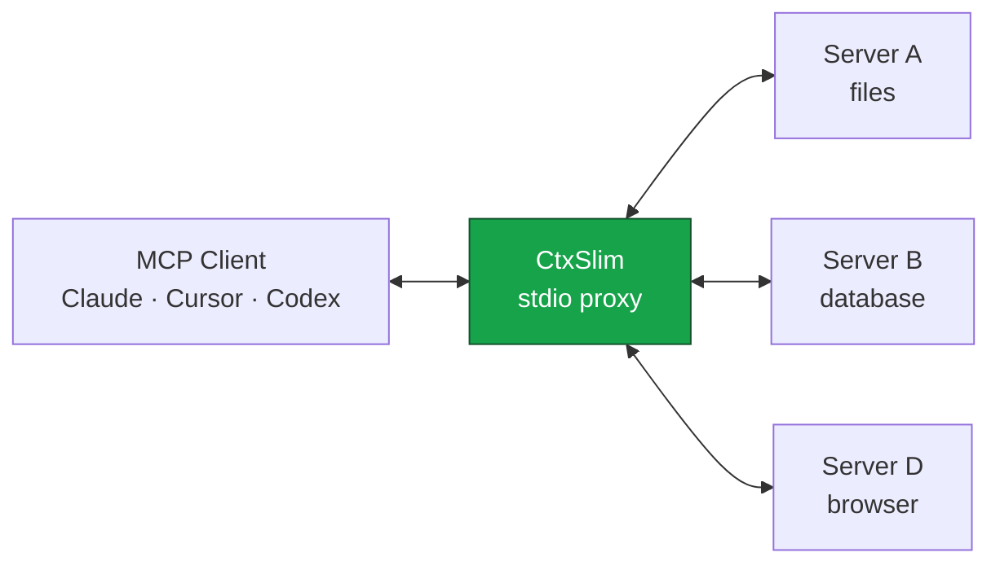

<div align="center">


# CtxSlim

**Your MCP servers are eating your context. Put them on a diet.**


[](https://www.npmjs.com/package/ctxslim)
[](https://www.npmjs.com/package/ctxslim)
[](https://github.com/v01dst/ctxslim/actions)
[](LICENSE)
[](https://nodejs.org)
[](CONTRIBUTING.md)
[](https://github.com/v01dst/ctxslim/stargazers)

*One config entry. Every MCP server you already have. A fraction of the context.*

</div>

---

Every MCP server you connect dumps its **entire tool catalog** into every LLM request. Six servers × twelve tools ≈ **36,000 tokens per request** before your prompt even starts — slower answers, bigger bills, a dumber agent.

**CtxSlim is a proxy that fixes this.** One entry in your client config; it talks to your *N* servers and exposes only what matters, compressed — zero API keys, zero cloud calls.

## 📊 Measured savings

From the bundled benchmark (`npm run bench`), through real MCP transports:

| Setup | Per request before | Compressed | Top-24 ranked |
| --- | ---: | ---: | ---: |
| 2 servers × 8 tools | 8.4k tokens | −17.8% | −17.8% |
| 4 servers × 10 tools | 20.4k tokens | −17.8% | **−55.2%** |
| 6 servers × 12 tools | 36.2k tokens | −17.8% | **−74.7%** |

Bigger stacks save more — and production servers (GitHub, Notion, browser automation) ship heavier schemas than these fixtures.

## ⚡ Quick start

```bash
npx -y ctxslim init                          # preview what it found on your machine
npx -y ctxslim init --client cursor --yes    # wire it in (timestamped backup included)
```

Or one manual entry (stdio + HTTP servers both work):

```json
{
  "mcpServers": {
    "ctxslim": { "command": "npx", "args": ["-y", "ctxslim"] }
  }
}
```

Works with Claude Desktop · Claude Code · Cursor · Windsurf · VS Code · anything speaking MCP. Servers are auto-discovered read-only — or point explicitly via `--config`, `CTX_SLIM_CONFIG`, or a project-local `ctxslim.json`.

<details>
<summary><b>Full config reference</b></summary>

```json
{
  "mcpServers": {
    "playwright": {
      "command": "npx",
      "args": ["@playwright/mcp"],
      "include": ["browser_*"],
      "exclude": ["*_debug*"],
      "output": { "maxChars": 4000 },
      "images": { "scale": 0.5, "format": "jpeg", "quality": 70 }
    }
  },
  "slim": {
    "mode": "auto",
    "maxTools": 24,
    "descriptionBudget": 280,
    "connectTimeout": 15000,
    "stats": true,
    "adaptive": true,
    "disclosure": false,
    "pins": ["playwright::browser_navigate"],
    "allowlist": ["playwright"]
  }
}
```

| Key | Meaning |
| --- | --- |
| `mode` | `auto` top-K per turn (default) · `manual` allowlist + pins only · `off` pure aggregation |
| `maxTools` | Exposed-tool cap per turn (default 24) |
| `descriptionBudget` | Per-description char budget (default 280) |
| `connectTimeout` | Per-server boot timeout, ms (default 15000) |
| `stats` | Persist session stats (default true) |
| `adaptive` | Re-rank by your cross-session usage, persisted locally (default true) |
| `disclosure` | Stub listings + on-demand schemas (default false — §4) |
| `pins` | `server::tool` keys always exposed |
| `allowlist` | Servers permitted in `manual` mode |
| `include` / `exclude` | Per-server globs (`*`, `?`); `exclude` wins |
| `output.maxChars` | Truncate that server's text results, head + tail + marker (positive number; `{}` without it is rejected) |
| `images` | Downsample `image` results — `scale` in (0,1] default 0.5, `format` jpeg/png default jpeg, `quality` 1–100 default 70; needs optional `sharp`, otherwise passthrough with a warning |

</details>

## 🧠 How it works



**Startup.** Answers your client instantly and boots upstreams in the background — tools arrive via `list_changed` as each connects, so one slow server never blocks your session.

**The list.** Every `tools/list` scores each tool — BM25 match against your last search, your cross-session usage, manual pins, minus your globs — and exposes the top-K with compressed schemas (boilerplate stripped, descriptions budgeted, dead `$defs` dropped).

**The call.** Your agent calls any exposed — or hidden — tool by name; the proxy routes it to the right server. Results pass through your configured squeezes, then land in context. Every attempt is metered (sizes + arg hashes, never content).

**The loop.** Calls feed local usage data, so ranking improves the more you work. `slim_stats` reports this session, `stats` the lifetime, `audit` the dollars per task, `doctor --tune` the config fixes.

| Meta tool | What it does |
| --- | --- |
| `search_tools` | BM25 search across all servers — full schemas back for the matches |
| `describe_tools` | Full schemas for tools by exact name (batch-friendly) |
| `enable_tools` | Pin tools for the session so they're never swapped out |
| `list_servers` | Connection status and tool counts |
| `slim_stats` | Live tokens-saved report, this session |

## 💸 Spend audit

`ctxslim audit` turns the call meter into **per-task dollar spend**: top tasks and tools, duplicate-call and error waste called out, definitions shown per request as full + prompt-cached cost.

```
tasks               12
tool calls          148
tool-output spend   claude-sonnet-5 $0.0156  claude-opus-5 $0.0390  gemini-3.8-flash $0.0059
definitions/request ~9.2k tokens  claude-sonnet-5 $0.0184/$0.0018 (full/cached)
duplicate waste     $0.0021 (claude-sonnet-5)
```

`--gap` re-slices tasks · `--model` headlines a family · `--prices` overrides rates · `--json` for scripting. Tool outputs are priced as input tokens. Rates cover 10 real models (`claude-fable-5-1` … `gemini-3.8-flash`), indicative as of 2026-09-08.

## 🔍 Progressive disclosure (opt-in)

```json
{ "slim": { "disclosure": true } }
```

`list_tools` returns **stubs** — name, `{ "type": "object" }`, a 120-character description — while `search_tools` / `describe_tools` fetch full schemas on demand and stub-listed tools stay directly callable. Meta tools always render full.

## 🖼 Image downsampling (opt-in)

Set per-server `images` (see config reference) and `image` results are resized in-process. No `sharp` installed, no problem: results pass through with a stderr note. Nothing is ever stripped — transform or passthrough, no third option.

## 🎛 Auto-tune

```bash
ctxslim doctor --tune [--json]
```

Five deterministic rules over your real data — pins at ≥5 calls, `maxTools` from 90% coverage (either direction), zero-call servers as exclusion candidates, `output.maxChars` where average results exceed 8000 chars, disclosure past 6000 defs/request. **Suggest-only — nothing is ever written.**

## 🛠 CLI

```
ctxslim                       start the proxy
ctxslim init                  wire into a client config (--client, --yes, backup included)
ctxslim --config <path>       use a specific config
ctxslim --mode <mode>         auto | manual | off
ctxslim --max-tools <n>       override top-K
ctxslim --no-stats            no stats, usage, or audit files
ctxslim --quiet               minimal logging
ctxslim stats [--json]        lifetime savings
ctxslim audit [--gap] [--model] [--prices] [--json]
                              per-task dollar spend
ctxslim doctor [--tune] [--json]
                              validate config (+ tune suggestions)
```

## 🔒 Privacy

**100% local.** No API keys, no telemetry, no network calls except to your own MCP servers. Stats, usage, and audit files live under `~/.ctxslim` and all die with `--no-stats`. The meter stores sizes and SHA-1 hashes only — but hashes identify repeats rather than hiding low-entropy values, so treat `audit.jsonl` as sensitive. Images are transformed in-process and never leave the machine.

## ❓ FAQ

**Does my agent still find hidden tools?**
Yes — search returns full schemas for matches, and even a direct call to a known-but-hidden tool by name gets routed. Nothing is ever hard-blocked.

**Why not just install fewer servers?**
Because you installed them for a reason. The problem isn't having tools — it's paying for all of them in every single prompt.

**Where are the tests?**
131 of them (`npm test`) — compressor, ranking + adaptive scoring, globs, truncation, disclosure, images, lazy connect, persistence, audit/pricing/tune, and a full integration suite over real MCP transports.

## 🤝 Contributing

Genuinely welcome — see [CONTRIBUTING.md](CONTRIBUTING.md). Small, strict, comment-free codebase; a nice one to read. **Say hi:** [open an issue](https://github.com/v01dst/ctxslim/issues/new) with your use case.

## ⭐ Star history

If CtxSlim saved you tokens, a star helps other developers find it:

[](https://github.com/v01dst/ctxslim/stargazers)

## License

[MIT](LICENSE) © 2026

---

<div align="center">
<sub><b>Slim</b> lost the weight so your context doesn't have to.</sub>
</div>
