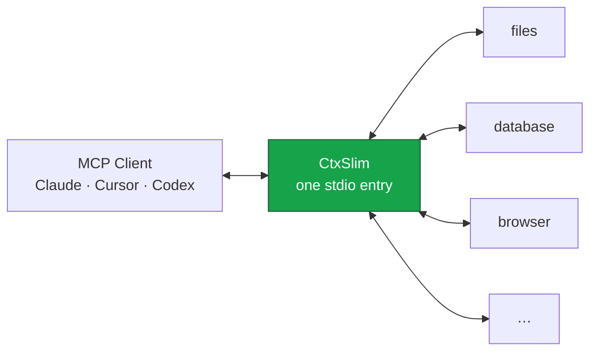

<div align="center">
  
</div>

# CtxSlim

> **Put your MCP servers on a diet.** One proxy entry replaces your whole MCP stack — your agent keeps every tool, your context keeps 26k more tokens per request.

[](https://www.npmjs.com/package/ctxslim)
[](https://www.npmjs.com/package/ctxslim)
[](https://github.com/v01dst/ctxslim/actions)
[](LICENSE)
[](https://nodejs.org)
[](CONTRIBUTING.md)
[](https://github.com/v01dst/ctxslim/stargazers)

<br/>

```bash
npx -y ctxslim init          # detects Claude Desktop / Cursor / Windsurf / VS Code / Claude Code
npx -y ctxslim init --client cursor --yes    # wires itself in, timestamped backup included
```

Your servers stay exactly where they are. CtxSlim reads them (read-only), connects to all of them itself, and your client only ever sees one MCP server: Slim.

<br/>

## Why

Every MCP server dumps its **entire tool catalog** into every single LLM request — names, descriptions, JSON schemas, the lot. Six servers × twelve tools ≈ **36k tokens per request**, before your prompt even starts. That's slower answers, bigger bills, and a worse agent.

| 6 servers × 12 tools | tokens / request | |
| --- | ---: | --- |
| raw stack | 36.2k | 🔴 |
| **+ ctxslim** | **9.2k** | 🟢 **−74.7%** |

Measured through real MCP transports (`npm run bench`). Bigger stacks save more.

## Features

- **Adaptive context budget** — ranked tools are admitted by exact token cost, not just count; the BudgetGuard enforces a hard ceiling so an oversized tool cannot silently blow the budget
- **Cost-exact compression** — admission cost is calculated from the exact compressed representation that will be exposed, eliminating estimate/exposure drift
- **Predictive tool affinity** — recent tool sequences create a local affinity graph, so tools commonly used after the current tool receive a bounded routing boost
- **Top-K exposure** — BM25 ranking + your usage history pick the tools that matter per turn; the rest stay one `search_tools` away, never blocked
- **Schema compression** — boilerplate stripped, descriptions budgeted, dead `$defs` dropped
- **Adaptive ranking** — tools you actually call get a boost, learned across sessions
- **Progressive disclosure** — opt-in stub listings (~40 tokens/tool) with on-demand full schemas
- **Lazy connect** — instant startup; upstream servers boot in the background
- **Output diet** — safely minify JSON text results, truncate giant text results, and downsample screenshots (opt-in, per server)
- **Spend audit** — every call metered; `ctxslim audit` prices it per task in dollars
- **Auto-tune** — `ctxslim doctor --tune` reads your real usage and suggests config fixes (never writes)
- **100% local** — no API keys, no telemetry, no cloud. Works with stdio and Streamable HTTP servers

## How it works



1. **Startup** — Slim answers your client instantly, boots your servers in the background, and announces each as it lands.
2. **Listing** — every `tools/list` scores all tools (search relevance + usage + local tool affinity + pins − globs), compresses them once, then admits the highest-value representations through a hard token budget. Oversized candidates are skipped instead of overflowing the budget.
3. **Discovery** — `search_tools` and `describe_tools` pull full schemas on demand; hidden tools stay directly callable. Nothing is hard-blocked, ever.
4. **Calls** — routed transparently to the right server; results pass through your squeezes (`output.maxChars`, `images`) before entering context.
5. **Learning** — every call feeds local stats; `slim_stats` shows the session, `stats` the lifetime, `audit` the money, `doctor --tune` the next config fix.

<details>
<summary><b>Config reference</b></summary>

```jsonc
{
  "mcpServers": {
    "playwright": {
      "command": "npx",
      "args": ["@playwright/mcp"],
      "include": ["browser_*"],          // per-server globs; exclude wins
      "exclude": ["*_debug*"],
      "output": { "maxChars": 4000 },    // truncate this server's text results
      "images": { "scale": 0.5, "format": "jpeg", "quality": 70 }  // needs optional `sharp`
    }
  },
  "slim": {
    "mode": "auto",              // auto | manual (allowlist + pins) | off (pure aggregation)
    "maxTools": 24,              // hard cap on exposed tools
    "contextBudget": 6000,        // adaptive token budget for exposed tool definitions
    "adaptive": true,            // learn from usage across sessions
    "disclosure": false,         // stub listings + on-demand schemas
    "pins": ["playwright::browser_navigate"],
    "descriptionBudget": 280,
    "connectTimeout": 15000,
    "stats": true
  }
}
```

</details>

<details>
<summary><b>CLI</b></summary>

```
ctxslim                       start the proxy
ctxslim init                  wire into a client config (--client, --yes, backup included)
ctxslim --config <path>       use a specific config
ctxslim --mode <mode>         auto | manual | off
ctxslim --max-tools <n>       override top-K
ctxslim --no-stats            no stats, usage, or audit files
ctxslim --quiet               minimal logging
ctxslim stats [--json]        lifetime savings
ctxslim audit [--gap] [--model] [--prices] [--json]
                              per-task dollar spend across 10 real models
ctxslim doctor [--tune] [--json]
                              validate config (+ suggest-only tuning)
```

</details>

<details>
<summary><b>Spend audit & pricing</b></summary>

Every routed call is metered to `~/.ctxslim/audit.jsonl` (sizes + hashes, never content). `ctxslim audit` groups calls into tasks by idle gap and prices them:

```
tasks               12
tool calls          148
tool-output spend   claude-sonnet-5 $0.0156  claude-opus-5 $0.0390  gemini-3.8-flash $0.0059
definitions/request ~9.2k tokens  claude-sonnet-5 $0.0184/$0.0018 (full/cached)
duplicate waste     $0.0021 (claude-sonnet-5)
```

Tool outputs are priced as input tokens; definitions show full + prompt-cached cost. Rates are indicative (as of 2026-09-08) for `claude-fable-5-1`, `claude-opus-5`, `claude-sonnet-5`, `claude-haiku-4-5`, `gpt-6-astra`, `gpt-5.6-sol/terra/luna`, `gemini-3.1-pro`, `gemini-3.8-flash` — override anytime with `--prices`.

</details>

## Context engine architecture

CtxSlim treats context as a constrained resource rather than a pile of JSON.

```text
MCP servers
    │
    ▼
Context Router ── relevance + usage + tool affinity
    │
    ▼
Tool Optimizer ── schema compression + metadata preservation
    │
    ▼
BudgetGuard ──── exact admission cost + hard ceiling
    │
    ▼
MCP client context
    │
    ▼
Result Optimizer ── JSON compaction + truncation + images
```

### Experimental techniques

- **BudgetGuard**: one deterministic admission controller owns the context ceiling. Pinned tools no longer bypass the ceiling by accident.
- **Cost-Exact Compression**: a candidate is compressed once and its actual serialized representation is used for admission accounting.
- **Predictive Tool Affinity**: successful tool sequences build a bounded in-memory transition graph. If browser_navigate → browser_click is common in a session, the second tool receives a small routing boost on the next listing.
- **Progressive Discovery**: tools that do not fit remain callable and discoverable through `search_tools`, avoiding the classic top-K dead end.

The design goal is not merely a high percentage reduction. It is **bounded context growth**: adding MCP servers should increase discovery space without forcing the full catalog into every request.

## FAQ

<details>
<summary><b>Does my agent still find tools outside the top-K?</b></summary>

Yes. `search_tools` returns full schemas for matches, and even a direct call to a known-but-hidden tool gets routed. Nothing is ever hard-blocked.
</details>

<details>
<summary><b>Why not just install fewer servers?</b></summary>

Because you installed them for a reason. The problem isn't having tools — it's paying for all of them in every single prompt.
</details>

<details>
<summary><b>Where are the tests?</b></summary>

131 of them (`npm test`) — compressor, ranking + adaptive scoring, globs, truncation, disclosure, images, lazy connect, persistence, audit/pricing/tune, plus an integration suite speaking real MCP over real transports.
</details>

## Contributing

Genuinely welcome — see [CONTRIBUTING.md](CONTRIBUTING.md). Small, strict, comment-free codebase; a nice one to read. Say hi via [issues](https://github.com/v01dst/ctxslim/issues/new).

## Star history

[](https://github.com/v01dst/ctxslim/stargazers)

## License

[MIT](LICENSE) © 2026

---

<div align="center">
  <sub><b>Slim</b> lost the weight so your context doesn't have to.</sub>
</div>
