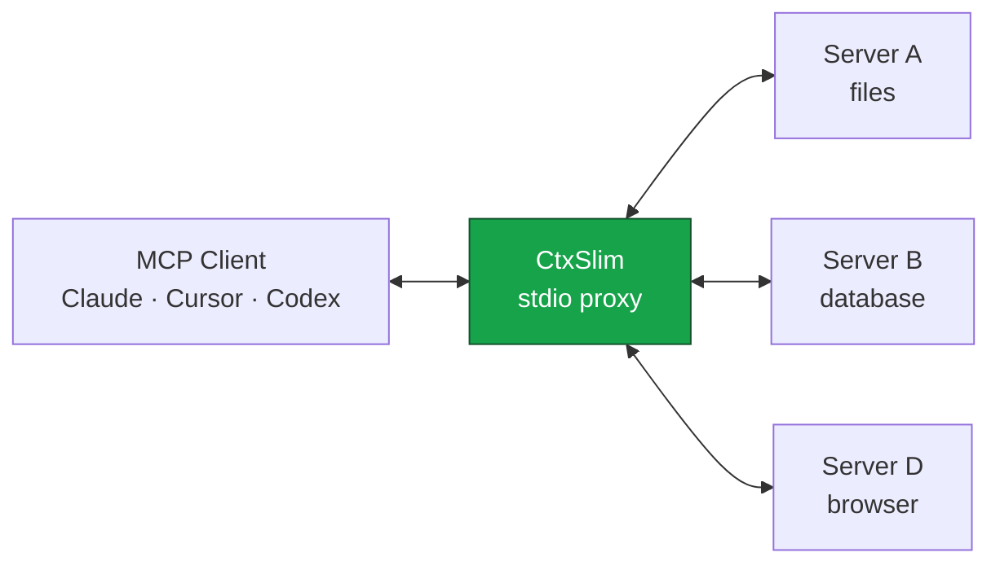

<div align="center">


# CtxSlim

**Your MCP servers are eating your context. Put them on a diet.**


[](https://www.npmjs.com/package/ctxslim)
[](https://www.npmjs.com/package/ctxslim)
[](https://github.com/v01dst/ctxslim/actions)
[](LICENSE)
[](https://nodejs.org)
[](CONTRIBUTING.md)
[](https://github.com/v01dst/ctxslim/stargazers)

*One config entry. Every MCP server you already have. A fraction of the context.*

</div>

---

Every MCP server you connect dumps its **entire tool catalog** into your LLM's context — every name, every description, every JSON Schema property. Connect a database server, a browser server and a GitHub server and you can burn **30,000+ tokens before you've asked a single question**. Your responses get slower, your bill gets bigger, and your agent gets dumber because it's drowning in tool definitions it doesn't need.

**CtxSlim is a proxy that fixes this.** It sits between your MCP client and your servers, exposes only the tools that matter for the current task, and compresses the schemas of what it does expose — with zero API keys, zero cloud calls, zero config rewriting.

## 📊 Measured savings

Real numbers from the bundled benchmark (`npm run bench`), measured through actual MCP transports — not marketing math:

| Setup | Context before | After compression | With top-24 ranking |
| --- | ---: | ---: | ---: |
| 2 servers × 8 tools | 7.4k tokens | −17.7% | −17.7% |
| 4 servers × 10 tools | 18.5k tokens | −17.7% | **−50.6%** |
| 6 servers × 12 tools | 33.4k tokens | −17.7% | **−72.6%** |

The more servers you stack, the more Slim saves. And that's with modest schemas — real-world servers (GitHub, Notion, browser automation) ship far heavier definitions.

## ⚡ Quick start

**Option 1 — the one-liner.** Wire CtxSlim into your client (Claude Desktop, Cursor, Windsurf, VS Code, Claude Code) in seconds:

```bash
npx -y ctxslim init                          # preview: shows what it found on your machine
npx -y ctxslim init --client cursor --yes    # writes it (timestamped backup included)
```

**Option 2 — manual.** Replace your stack of MCP server entries with a single one:

```json
{
  "mcpServers": {
    "ctxslim": {
      "command": "npx",
      "args": ["-y", "ctxslim"]
    }
  }
}
```

That's it. CtxSlim **auto-discovers** the servers already configured in your existing client config (read-only — your files are never modified) and connects to all of them itself.

Works with:

- **Claude Desktop** · **Claude Code** · **Cursor** · **Windsurf** · **VS Code** · anything that speaks MCP
- Or point it at any config explicitly: `npx -y ctxslim --config /path/to/mcp.json`
- Or set `CTX_SLIM_CONFIG=/path/to/mcp.json`
- Or drop a `ctxslim.json` in your project directory

Keep your servers as they are — CtxSlim reads them:

```json
{
  "mcpServers": {
    "github": { "command": "npx", "args": ["-y", "@modelcontextprotocol/server-github"] },
    "postgres": { "command": "npx", "args": ["-y", "@modelcontextprotocol/server-postgres", "postgresql://localhost/mydb"] }
  },
  "slim": {
    "mode": "auto",
    "maxTools": 24,
    "connectTimeout": 45000
  }
}
```

Per-server filtering, output limits, and adaptive ranking:

```json
{
  "mcpServers": {
    "playwright": {
      "command": "npx",
      "args": ["@playwright/mcp"],
      "include": ["browser_*"],
      "exclude": ["*_debug*"],
      "output": { "maxChars": 4000 }
    }
  },
  "slim": { "adaptive": true, "maxTools": 24 }
}
```

- `include` / `exclude`: glob lists applied per server at indexing time (`*` matches any run including separators, `?` matches one char). `exclude` wins over `include`.
- `output.maxChars`: truncate text tool results from that server to N chars (with a truncation marker). Structured content passes through untouched. `"output": {}` without `maxChars` is rejected with an invalid `output.maxChars` error.
- `slim.adaptive`: when `true` (default), tools you actually call get a usage boost in ranking, persisted to `~/.ctxslim/usage.json`. Set `false` to disable.

## 🧠 How it works



1. On startup, Slim answers **instantly** (lazy connect): the proxy connects to your client immediately and boots each upstream server in the background — servers appear as they connect (`✓ <name> (N tools)` on stderr) instead of blocking startup on the slowest one.
2. In `auto` mode it exposes only the top-K most relevant tools, plus a `search_tools` meta-tool your agent uses to pull in anything else on demand — progressive disclosure instead of a 40-tool firehose.
3. Exposed schemas are **compressed**: boilerplate keywords stripped, descriptions trimmed to a budget, unused `$defs` dropped — measured with a chars/4 token estimator and reported back to you.
4. Tool calls are routed transparently to the right upstream server. Your agent can't tell the difference — except its context is lighter.

Your agent gets five superpowers:

| Meta tool | What it does |
| --- | --- |
| `search_tools` | Semantic-ish BM25 search across all connected servers |
| `enable_tools` | Pin tools for the session so they're never swapped out |
| `describe_tools` | Fetch full schemas for stub-listed tools by name |
| `list_servers` | See what's connected and how healthy it is |
| `slim_stats` | Live report of tokens saved this session |

## 🎛 Modes

| Mode | Behavior |
| --- | --- |
| `auto` | Top-K relevant tools per turn + meta tools. **Default.** |
| `manual` | Only servers you allowlist, only tools you pin. Deterministic. |
| `off` | Pure aggregation proxy — every tool, uncompressed. Useful just to unify N servers behind one entry. |

## 🛠 CLI

```
ctxslim                       start the proxy
ctxslim init                  wire the proxy into a detected client config
                              (--client <name|path>, --yes to write, backup included)
ctxslim --config <path>       use a specific config
ctxslim --mode <mode>         auto | manual | off
ctxslim --max-tools <n>       override top-K (default 24)
ctxslim --no-stats            don't persist session stats
ctxslim --quiet               minimal logging
ctxslim stats [--json]      show lifetime savings (JSON with --json)
ctxslim audit [--gap <s>] [--model <fam>] [--prices <file>] [--json]
                                show per-task dollar spend (prices are estimates)
ctxslim doctor [--tune] [--json]  validate config + connectivity (tune suggests improvements)
```

Session stats live in `~/.ctxslim/stats.jsonl`. Run `ctxslim stats` after a week of work and watch the cumulative savings. `ctxslim stats --json` emits `{ "summary": {...}, "byTool": [...] }` with per-tool call counts for scripting.

## 💸 Spend audit

Every tool call the proxy routes is metered to `~/.ctxslim/audit.jsonl`. `ctxslim audit` turns that meter into **per-task dollar spend**: calls are grouped into tasks by session with an idle gap, then ranked as top tasks and top tools, with duplicate-call and error waste called out separately.

Example sketch:

```
tasks               12
tool calls          148
tool-output spend   claude-sonnet-5 $0.0156  claude-opus-5 $0.0390  gemini-3.8-flash $0.0059
definitions/request ~9.2k tokens  claude-sonnet-5 $0.0184/$0.0018 (full/cached)
duplicate waste     $0.0021 (claude-sonnet-5)
error waste         $0.0005 (claude-sonnet-5)

Top tasks (claude-sonnet-5)
  task-03      21 calls  $0.0041  github
Top tools (claude-sonnet-5)
    34×  $0.0054  github::search_code
Duplicate calls (paid N× for identical args)
     5×  $0.0013 waste  github::search_code
```

Flags:

- `--gap <s>`: idle seconds that split one task from the next (default: 120).
- `--model <fam>`: headline family for the waste and top-list figures (default: claude-sonnet-5).
- `--prices <file>`: custom price-table JSON overriding the built-in table.
- `--json`: full machine-readable `{ summary, tasks, tools, waste }` for scripting.

Two pricing rules: tool outputs are priced as **input** tokens (chars/4 estimator), and definitions are shown per request as **full/cached** so you see both the uncompressed and prompt-cached cost. Prices are indicative as of 2026-09-08 — override with `--prices` when they drift. Built-in families: `claude-fable-5-1`, `claude-opus-5`, `claude-sonnet-5`, `claude-haiku-4-5`, `gpt-6-astra`, `gpt-5.6-sol`, `gpt-5.6-terra`, `gpt-5.6-luna`, `gemini-3.1-pro` (≤200K context tier), `gemini-3.8-flash` (intro price, doubles Jan 2027).

## 🔍 Progressive disclosure

When tool catalogs are huge, even compressed schemas add up. Opt in with `slim.disclosure: true`:

```json
{
  "slim": { "disclosure": true }
}
```

With disclosure on, `list_tools` returns **stubs** instead of full schemas: each tool keeps only its `name`, a stub `inputSchema` of `{ "type": "object" }`, and a description trimmed to 120 characters (word-boundary trimmed). Meta tools (`search_tools`, `describe_tools`, …) always keep their full schemas. Stub-listed tools stay fully callable — nothing is ever hard-blocked.

Your agent fetches what it needs on demand:

1. `search_tools` is the discovery path — search by task, get back full compressed schemas for the matches.
2. `describe_tools` fetches full compressed schemas for tools by exact name (batch-friendly, ideal after seeing a stub list or search results). Unknown names are reported back and ignored.

Disclosure is **off by default** — without the flag you get the standard full (compressed) schemas.

## 🖼 Image downsampling

Vision-heavy servers (browser, camera, screenshot tools) can flood context with full-resolution images. Cap them per server:

```json
{
  "mcpServers": {
    "playwright": {
      "command": "npx",
      "args": ["@playwright/mcp"],
      "images": { "scale": 0.5, "format": "jpeg", "quality": 70 }
    }
  }
}
```

Defaults when a key is omitted: `scale` 0.5, `format` `"jpeg"`, `quality` 70. `scale` must be in (0, 1], `format` is `"jpeg"` or `"png"`, `quality` is an integer 1–100 (invalid values are rejected at config load).

Requires `sharp`, kept as an **optional** peer dependency so the default install stays light:

```bash
npm i sharp
```

Behavior is **fail-open**: without `sharp` installed, results pass through unchanged (a stderr note says so); if a single image fails to transform, that item passes through with a warning. Image handling never strips content — it only downsamples `image` items in tool results, leaving text and structured content untouched.

## 🎛 Auto-tune

`ctxslim doctor --tune [--json]` reads your real usage (`usage.json`), session history (`stats.jsonl`) and call meter (`audit.jsonl`) and suggests config improvements. **Suggest-only — nothing is ever written.**

The five rules:

- **Pins** (usage ≥ 5 calls): tools you call that often belong in `slim.pins`.
- **maxTools** (90% call coverage): smallest K covering 90% of recorded calls; suggested when below your current `maxTools` (default 24), or above it when more distinct tools were called.
- **Consider excluding** (zero calls everywhere): servers with no usage, audit, or stats footprint — e.g. `consider exclude: ["*"]`.
- **Output caps** (avg result > 8000 chars): servers whose average tool result exceeds 8000 chars get `output.maxChars 4000`.
- **Disclosure** (mean definitions > 6000 tokens): when average per-session definitions exceed 6000 tokens and disclosure is off, suggests `slim.disclosure: true`.

`--json` emits the machine-readable `{ pins, maxTools, considerExclude, outputCaps, enableDisclosure, notes }` contract for scripting. With no data yet, every section reports `no data` and notes tell you to run ctxslim with your client first.

## 🔒 Privacy

CtxSlim is **100% local**. No API keys. No telemetry. No network calls except to the MCP servers you configure. Your tool definitions never leave your machine. Session stats (`~/.ctxslim/stats.jsonl`), tool usage (`~/.ctxslim/usage.json`) and the audit meter (`~/.ctxslim/audit.jsonl`) stay on your disk, are local-only, and are all disabled by `--no-stats`. The audit meter records sizes and hashes only — never argument or result content. Note that the hashes identify repeated calls, not hide low-entropy argument values — treat `audit.jsonl` as sensitive local data. Image bytes are transformed locally in-process and never leave the machine; `sharp` (if installed) runs locally too.

## ❓ FAQ

**Does my agent really find tools that aren't exposed?**
Yes — that's what `search_tools` is for. Modern agents call it when a task needs something outside the exposed set, get the full compressed schema back, and call the tool. Even if a model skips search and calls a known-but-hidden tool by name, Slim routes it anyway. Nothing is ever hard-blocked.

**Why not just install fewer servers?**
Because you installed them for a reason. The problem isn't having tools — it's paying for all of them in every single prompt.

**What about tool-name collisions?**
If two servers expose the same tool name, Slim prefixes them (`server__tool`) and routes correctly.

**Does it work with HTTP servers?**
Yes — `url` entries are proxied via Streamable HTTP alongside stdio servers.

**Where are the tests?**
 131 of them, covering the compressor, the ranking engine (including adaptive scoring), glob filtering, output truncation, progressive disclosure (`slim.disclosure` + `describe_tools`), image downsampling (fail-open engine), lazy connect, usage persistence, config discovery, the `init` flow, the spend-audit CLI (audit metering, pricing, and JSON output), the `doctor --tune` suggester, and a full integration suite that speaks real MCP over real transports. `npm test`.

**Is it on npm?**
Yes — [npmjs.com/package/ctxslim](https://www.npmjs.com/package/ctxslim). `npx -y ctxslim` runs it with zero install.

## 🤝 Contributing

Contributions are genuinely welcome — see [CONTRIBUTING.md](CONTRIBUTING.md) for the how and the why. The codebase is small, strict and comment-free on purpose; it's a nice one to read.

**Say hi:** [open an issue](https://github.com/v01dst/ctxslim/issues/new) with your use case.

## ⭐ Star history

If CtxSlim saved you tokens, a star helps other developers find it:

[](https://github.com/v01dst/ctxslim/stargazers)

## License

[MIT](LICENSE) © 2026

---

<div align="center">
<sub><b>Slim</b> lost the weight so your context doesn't have to.</sub>
</div>
